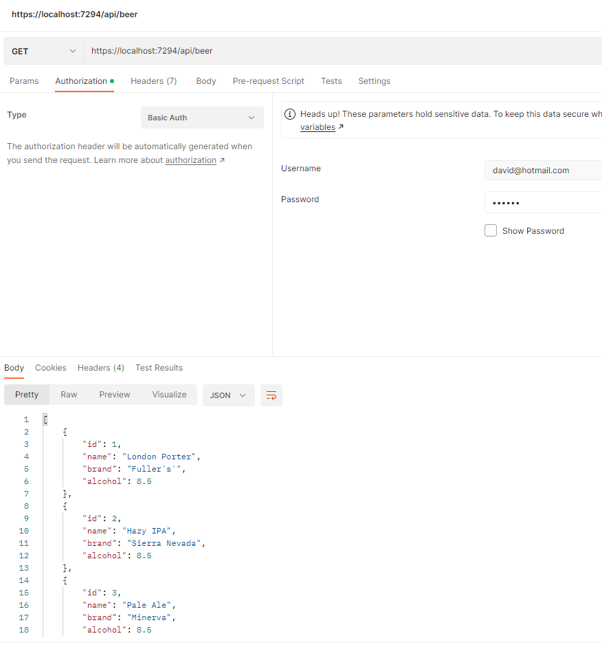

# BasicSecurityAsp: Proyecto de utilización de autentificación básica
Pequeño ejemplo de lectura de un método, mediante autenticación básica.

Los puntos funcionales del ejemplo son:
* Lectura de un .json de cervezas (llamado "beers.json"), a través de la clase BeerService.cs.
* A la acción Get del controlador BeerController solo se podrá acceder si se está autenticado con autenticación básica (user / password)

Los puntos técnicos del ejemplo son:
* Uso de NET6
* Uso de AuthenticationHandler

### Pre-requisitos 📋

Como herramientas de desarrollo necesitarás:
* Visual Studio 2022 (con la versión para .NET 6)

```
Nota: Visual Studio Code también valdría
```

## Ejecutando la aplicación ⚙️

* Una vez descargado el código, ejecutarlo.
* Acceder mediante Postman, y configurar el apartado Authoritation 

## Construido con 🛠️

* [Microsoft Visual Studio Community 2022](https://visualstudio.microsoft.com/es/vs/) - IDE  de desarrollo

## Autores ✒️
* Héctor de León [Basic Authentication en BACKEND](https://www.youtube.com/watch?v=IBhBmwOWK3o)
* **David Santesteban** - *Implementación del ejercicio* - [davidsantes](https://github.com/davidsantes)